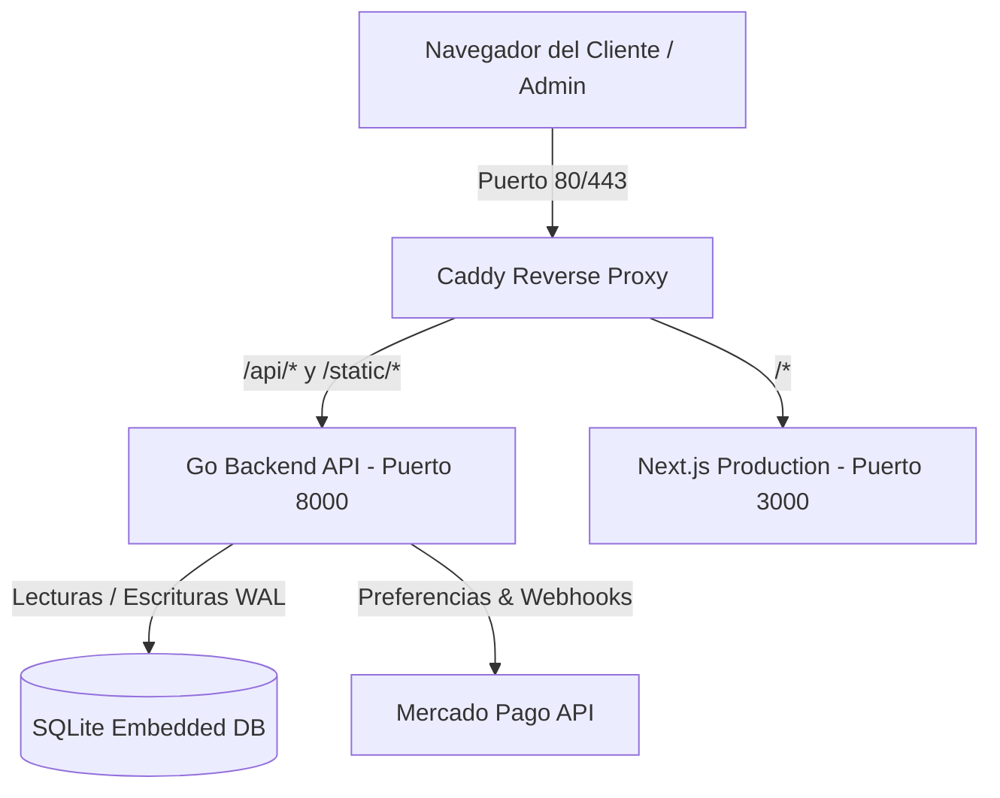

# 🕊️ Tienda Artisan - Documentación Técnica y de Arquitectura

**Tienda Artisan** es una plataforma e-commerce genérica orientada a emprendedores, diseñada para ofrecer máxima velocidad, elegancia y un consumo de recursos mínimo para correr en servidores en la nube de 1 vCPU y 1 GB de RAM (ej. Oracle Cloud E2.1.Micro).

---

## 🏗️ 1. Arquitectura del Sistema



### Stack Tecnológico:
- **Backend:** Go 1.22+ (Gin Web Framework + GORM + SQLite Pure Go / Postgres).
  - *Consumo de Memoria:* ~15 - 25 MB RAM.
  - *Latencia:* Sub-milisegundo.
- **Frontend:** Next.js 14 (React 18, TailwindCSS, Framer Motion, Lucide Icons).
  - *Modo:* Standalone Production Server optimizado.
- **Reverse Proxy:** Caddy Web Server (HTTP/2, compresión zstd/gzip, SSL Let's Encrypt automático).
- **Base de Datos:** SQLite con WAL (*Write-Ahead Logging*) por defecto (zero-config, ultra-rápido, sin overhead de servidor externo) con soporte transparente para PostgreSQL si se define `DATABASE_URL`.

---

## ⚡ 2. Perfil de Recursos en OCI E2.1.Micro (1 GB RAM)

| Componente | Consumo RAM Aproximado |
| :--- | :--- |
| **Sistema Operativo (Ubuntu Minimal)** | ~120 MB |
| **Backend Go (Compilado nativo)** | ~18 MB |
| **Frontend Next.js (Standalone)** | ~70 MB |
| **Caddy Web Server** | ~15 MB |
| **Memoria Libre Disponible** | **> 750 MB** |

> [!TIP]
> El script `install.sh` crea automáticamente un archivo de intercambio **SWAP de 2 GB** en `/swapfile`, garantizando que durante compilaciones de Node.js no se produzcan bloqueos por Out-Of-Memory (OOM).

---

## 🔌 3. Endpoints del API (Go)

### Autenticación
- `POST /api/auth/login`: Autenticación del panel administrativo mediante contraseña maestra. Retorna token de sesión.

### Configuración de la Tienda (Wizard)
- `GET /api/settings/`: Obtiene la configuración actual de la marca (nombre, logo, colores, textos, hero banner).
- `POST /api/settings/`: Actualiza la configuración y la identidad visual de la tienda.

### Catálogo de Productos
- `GET /api/products/`: Lista productos activos con soporte para búsqueda `?q=termino` y filtro `?category=categoria`.
- `GET /api/products/all`: Lista todos los productos (activos e inactivos) para el panel admin.
- `GET /api/products/:slug`: Retorna el detalle de un producto por su slug.
- `POST /api/products/`: Crea un nuevo producto.
- `PUT /api/products/:id`: Modifica un producto existente.
- `PATCH /api/products/:id/toggle-active`: Activa o desactiva un producto del catálogo público.
- `DELETE /api/products/:id`: Elimina un producto permanentemente.
- `POST /api/products/upload`: Subida de imágenes multipart (`file`).

### Pedidos e Inventario
- `POST /api/orders/`: Procesa una orden, valida el stock disponible y **descuenta las unidades atómicamente** dentro de una transacción.
- `GET /api/orders/`: Lista todos los pedidos con sus items y productos asociados.
- `GET /api/orders/:id`: Detalle de un pedido por ID.
- `PATCH /api/orders/:id/status`: Actualiza el estado del pedido (`pending`, `paid`, `shipped`, `cancelled`).

### Pagos (Mercado Pago)
- `POST /api/payments/create-preference`: Genera una preferencia de Checkout Pro en Mercado Pago.
- `POST /api/payments/webhook`: Escucha eventos IPN de Mercado Pago y marca pedidos como `paid` en tiempo real.

---

## 🛠️ 4. Comandos de Administración en el Servidor

```bash
# Ver estado de los servicios
systemctl status tienda-backend tienda-frontend caddy

# Reiniciar servicios
sudo systemctl restart tienda-backend
sudo systemctl restart tienda-frontend
sudo systemctl restart caddy

# Ver logs en vivo
journalctl -u tienda-backend -f
journalctl -u tienda-frontend -f
journalctl -u caddy -f

# Actualizar desde GitHub
sudo bash update.sh
```

---

## 🔑 5. Variables de Entorno (`backend/.env`)

| Variable | Descripción | Valor por Defecto |
| :--- | :--- | :--- |
| `PORT` | Puerto de escucha del backend | `8000` |
| `GIN_MODE` | Modo del router Gin (`release` o `debug`) | `release` |
| `DATABASE_URL` | Archivo SQLite o conexión PostgreSQL | `ecommerce.db` |
| `BACKEND_URL` | URL pública del backend (para URLs de imágenes) | `http://localhost:8000` |
| `FRONTEND_URL` | URL pública de la tienda (para retornos de pago) | `http://localhost:3000` |
| `ADMIN_PASSWORD` | Contraseña maestra del panel `/admin` | `admin123` |
| `MP_ACCESS_TOKEN` | Token de producción o prueba de Mercado Pago | `TEST-...` |
| `UPLOAD_DIR` | Directorio en disco para imágenes subidas | `./uploads` |
